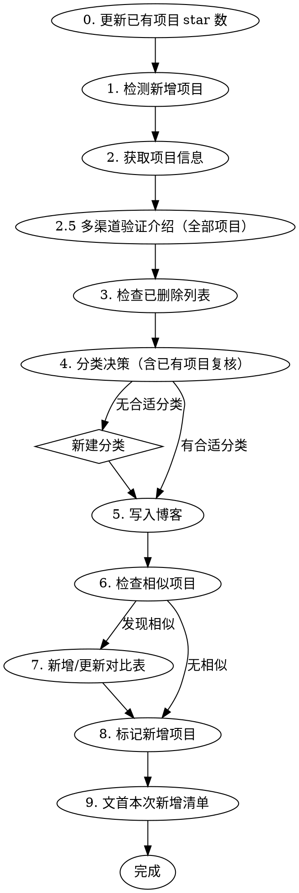

# 同步 GitHub Star 项目到博客

将用户 GitHub 新收藏的项目同步到 `source/_posts/项目收藏.md`，完成分类、写入和同类对比。

仓库内路径：`.agents/skills/sync-starred-projects/`（Agent Skills 规范位置，OMP `enableAgentsProject` / Codex 项目 skill / 本机 user junction 都指向这里）。Claude Code 从 `.claude/skills/sync-starred-projects/SKILL.md` 指针进入后读本文件。

## 流程



## Harness 与工具

机械步骤（star 实测、分页 starred、差集、易主检测）**先跑脚本**，不要手写循环或抽查：

```bash
HTTPS_PROXY= HTTP_PROXY= bun .agents/skills/sync-starred-projects/scripts/collect.mjs
```

PowerShell：`$env:HTTPS_PROXY=''; $env:HTTP_PROXY=''; bun .agents/skills/sync-starred-projects/scripts/collect.mjs`

完成标准：stdout 一份 JSON（`blog` / `newStars` / `skippedDeleted` / `skippedOwn`）。`blog[]` 覆盖博客里每一个 `github.com/owner/repo`，每条含 `apiStars`、`formatted`、`canonical`。缺条就是没跑完。

`gh` 失败先清代理再试（本机失效代理常连 `127.0.0.1:7897`）：`HTTPS_PROXY= HTTP_PROXY= gh api ...`

取证按当前 harness 选**能直连的通道**，不要绑死某个产品的搜索工具名：

1. GitHub 元数据 / README → `gh api`（脚本已拉 description/homepage/topics；README 用 `gh api repos/{owner}/{repo}/readme -H "Accept: application/vnd.github.raw"`）
2. 已知 URL（homepage、文档站）→ 直接抓取（OMP `read` URL、Codex fetch、Claude WebFetch）
3. 需要关键词搜索 → 打开 `https://cn.bing.com/search?q=` 或当前 harness 可用且未耗尽配额的搜索。**本机 OMP 不要调用 `web_search`**（kimi 配额与对话共享，其余免登录引擎被墙）

## 0. 更新已有项目 star 数

以 `collect.mjs` 的 `blog[]` 为准：

1. 对每个项目把 `formatted`（API 实测格式化）和 `blogStars`（博客现值）并排比对，有差异就改博客。四舍五入到一位小数按真实数字算（50543 → 50.5k），不要凭旧值微调。
2. `renamed: true` → 博客链接改成 `canonical`，star 一并改，汇报里点名。
3. 引言「Star 数截至」改为当天。

除 star 数字和已易主链接外，本步不改项目名、描述。

## 1. 检测新增项目

`collect.mjs` 已分页拉 `users/SpeechlessPanda/starred`（`per_page=100` 直到空页）并与博客做差集。

- 用户直接给了项目 URL → 跳过检测，用该项目（仍要跑脚本刷新已有 star）。
- `newStars[]` 即候选。`skippedOwn`（`SpeechlessPanda/*`）和 `skippedDeleted` 不入博客。

## 2. 获取项目信息

对每个新增项目，脚本已给出 `stargazers_count` / `description` / `homepage` / `topics`。description 空或含糊 → 再读 README 开头。

## 2.5 多渠道验证介绍（新增 + 已有全部项目）

验证范围是**博客里的所有项目**，不只本轮新增。只读 README 不够。每个项目至少交叉验证以下渠道中的两个；介绍里有具体数字/排名的要三个以上：

1. GitHub API 元数据（description、topics、homepage）—— description 为空必须读 README
2. README 正文
3. 项目官网（homepage）
4. 第三方来源（报道、评测、awesome 列表）——用上面的取证通道，子代理也必须实际抓取，不能只看喂给它的材料

**验证要点：**

- **数字类 claim 必须有出处**：如「300+ 助手」「减少 60-95% token」。找不到原文就改写成不含该数字。区分适用范围（Headroom 的 60-95% 只针对 JSON，编码代理场景约 15-20%）。
- **区分官方宣称与事实**：「基准测试最好」「事实标准」若只是官方自称，介绍里点明或弱化。
- **功能清单以现状为准**：以当前 README 的包/功能列表为准（Pi 的 Slack 机器人已拆到 `pi-chat`）。
- **复用已验证的事实**：本轮 README 已确认的（如 NapCat 推荐 SnowLuma）不必再派代理重复搜。
- 项目多则并行子代理按分类切分（每组 15–20 个），每项返回 `accurate` / `minor_fix` / `wrong` + 证据 URL + 修正要点。
- 介绍与事实不符 → 改该条目（核对修正），汇报里列出原因。

## 3. 检查已删除列表

权威列表：本 skill 的 [references/deleted-projects.md](references/deleted-projects.md)。再扫一遍当前 harness 的记忆（Claude `blog-deleted-projects`、OMP `memory://`、Codex memories）把多出来的名字合并进这份文件。命中则跳过并告知用户。

## 4. 分类决策

读当前博客，按**实际用途**匹配已有 `` 分类，不按技术栈。

- 第 2.5 步发现归类错误 → 改介绍并挪分类（PaperX 是「论文 PDF → PPT/海报」，不是论文写作辅助）。汇报里说明。
- 都不贴 → **新建分类**：2–6 个中文字，插在逻辑相邻处，标题下写一句说明。
- 两个分类拿不准 → 读分类说明句，看用途。

除核对修正外不改已有内容。只追加新项目、新分类，或修正核实有误的条目。

## 5. 写入博客

```markdown
- [项目名](https://github.com/owner/repo) ⭐ {star数} — {一句话简介}。{解决的问题}。{亮点}。
```

star 格式与 `collect.mjs` 的 `formatted` 一致：`>=1000` → 一位小数 + `k`（47.0k、130.5k）；`<1000` → 原样数字。

简介：中文，2–3 句，是什么 → 解决什么 → 亮点。

插入：追加到所属分类末尾；与某条功能类似则相邻排。多个新项目处理完再一次性写入。写入前再读一遍博客文件。

## 6–7. 相似项目与对比表

相似：同一类问题、用户可能二选一、功能重叠但各有特色。

博客末尾「同类项目对比」：已有组则加入；没有则新建。

```markdown
### {领域描述}：{项目A} vs {项目B}

| 维度 | {项目A} | {项目B} |
| --- | --- | --- |
| {维度1} | ... | ... |
| 适合人群 | ... | ... |
| 选择建议 | ... | ... |
```

分隔行 `| --- |`，单元格单空格，不强制列对齐。维度覆盖交互形式、核心能力、定位、扩展方式，最后一行明确选择建议。

## 8. 标记新增项目

1. 清旧标：bullet 上的 `- 🆕 [` → `- [`。只匹配这个模式，别动描述里的 emoji。
2. 本轮实际新写入的条目加 `🆕 `：`- 🆕 [项目名](...)`。

本轮没有新增则清完后整篇无 🆕，正常。

## 9. 文首本次新增清单

引言（blockquote）之后、`<!-- more -->` 之前，维护一段本轮新增项目名：

```markdown
本次新增：{项目名1}、{项目名2}、{项目名3}。
```

- 名字与 bullet 里 `[项目名]` 一致，顿号分隔，句号收尾
- 覆盖上一轮这段，不累积历史
- 本轮零新增 → 删掉整段，不要留空「本次新增：」
- 必须在 `<!-- more -->` 之前，让首页摘要和 Atom `<summary>` 能带到

## 发表时间与 RSS

**禁止改 front-matter 的 `date`。** 本站 `permalink: :year/:month/:day/:title/`，改发表日会把 URL 从 `/2026/06/06/项目收藏/` 改成新日期路径，旧链接、Giscus（`data-mapping: pathname`）、既有 RSS `<id>` 全部失效。

Atom 由 Panda `node_modules/hexo-theme-panda/scripts/panda/feed.js` 写出，不靠改 `date` 推送：`updated_option: mtime`，保存文件即更新 `post.updated`；距发表超过 `feed.update_notify_hours`（默认 24h）会换新条目 id `{permalink}u/{timestamp}/` 并生成跳转 stub，阅读器当新条目推。

完成标准：`date:` 仍是原文发表时间；本轮有新增则文首有且仅有本轮项目名清单。

## 硬规则

- 核对修正（须汇报）：star 实测、易主链接、验证后的介绍改写、分类移动。
- `SpeechlessPanda/*` 不入收藏。
- 已删除列表里的不恢复。
- 脚本 JSON 是 star/差集的唯一数字来源；禁止沿用博客旧值或凭印象估算。
- 禁止改 `date:`。
