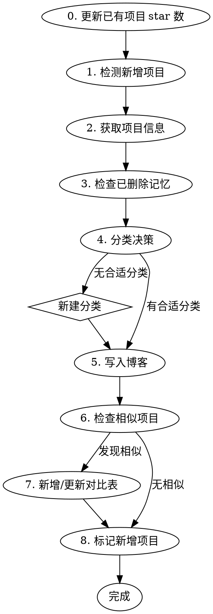

# 同步 GitHub Star 项目到博客

将用户 GitHub 新收藏的项目同步到 `source/_posts/项目收藏.md`，完成分类、写入和同类对比。

## 流程



## 0. 更新已有项目 star 数

每次运行 skill 时，先刷新博客中所有已有项目的 star 数：

1. 从博客文件提取所有 `github.com/owner/repo` 链接。
2. 对每个项目调用 `gh api repos/{owner}/{repo} --jq ".stargazers_count"` 获取当前 star 数。
3. 按 **star 数格式** 规则（>=1000 保留一位小数加 `k`，<1000 直接数字）更新博客文件中对应条目的 `⭐ {star数}`。
4. 更新文件顶部或引言中的「Star 数截至」日期为当天。

**注意：** 只更新 star 数字，不改项目名、链接、描述等其他内容。

## 1. 检测新增项目

用 `gh api` 获取用户最新 star 列表，与博客文件中已有的项目对比：

```bash
gh api users/SpeechlessPanda/starred --jq ".[].full_name"
```

再从博客文件中提取所有 `github.com/` 链接里的 `owner/repo`，两者做差集即为新增项目。

如果用户直接给出了项目 URL，跳过检测，直接用该项目。

## 2. 获取项目信息

对每个新增项目获取 star 数和描述：

```bash
gh api repos/{owner}/{repo} --jq ".stargazers_count, .description"
```

如果描述不够清晰，用 `gh api repos/{owner}/{repo}/readme` 获取 README 开头内容补充理解。

## 3. 检查已删除记忆

读取记忆文件 `blog-deleted-projects`，确认新项目不在已删除列表中。如果在列表中，跳过该项目并告知用户。

## 4. 分类决策

读取当前博客文件，了解所有已有分类。

**分类规则：**
- 扫描已有分类，判断新项目属于哪个（按功能领域匹配，不按技术栈）
- 如果新项目与已有分类都匹配度不高，则**新建分类**

**新建分类时：**
- 分类名用 2-6 个中文字符概括领域（如"排版模板"、"AI 编码代理"）
- 找到逻辑上最相邻的位置插入（如 Typst 模板插在"学术科研工具"后面）
- 在分类标题下写一句分类说明

**不改动已有内容。** 只追加新项目或新增分类，不修改、删除、移动已有条目。

## 5. 写入博客

每个项目的格式：

```markdown
- [项目名](https://github.com/owner/repo) ⭐ {star数} — {一句话简介}。{解决的问题}。{亮点}。
```

**star 数格式：**
- >= 1000：除以 1000 保留一位小数，加 `k`（如 47.0k、130.5k）
- < 1000：直接写数字

**简介要求：**
- 用中文描述
- 先说项目是什么，再说解决什么问题，最后点出亮点
- 控制在 2-3 句话

**插入位置：**
- 归入已有分类时，追加到该分类末尾
- 如果与该分类中某个项目功能类似，将两者相邻排列

## 6. 检查相似项目

写入后，扫描博客中所有分类，判断新项目是否与已有项目功能重叠（同一领域的竞品/替代品）。

**相似判断标准：**
- 解决同一类问题（如都是 AI 编码代理、都是 Typst 模板）
- 用户可能需要二选一
- 功能有重叠但有各自特色

## 7. 新增/更新对比表

博客末尾有「同类项目对比」板块。如果发现相似项目：

1. 检查是否已有该组的对比表
2. 如果没有，新建对比表；如果有，将新项目加入

**对比表格式：**

```markdown
### {领域描述}：{项目A} vs {项目B}

| 维度 | {项目A} | {项目B} |
| --- | --- | --- |
| {维度1} | ... | ... |
| {维度2} | ... | ... |
| 适合人群 | ... | ... |
| 选择建议 | ... | ... |
```

**表格风格：**
- 分隔行用 `| --- |`，单元格之间只保留一个空格
- 源码不强制列对齐，保持简洁紧凑
- 最终渲染或导出 PDF 时表格会自动对齐

**对比维度选择：**
- 交互形式（GUI/CLI/Web）
- 核心能力差异
- 定位和目标用户
- 扩展方式
- 最后加一行「选择建议」，给出明确的选择指引

## 注意事项

- **只追加不改已有内容**，除非用户明确要求
- 用户手动删除过的项目不要恢复，参照记忆文件
- 如果一次有多个新项目，全部处理完后再统一写入，避免多次覆盖
- 每次写入前先 Read 当前文件最新状态，避免覆盖用户的手动编辑

## 8. 标记新增项目

让读者一眼看出哪些项目是最近一次同步新增的。每次运行结束时执行：

1. **清除旧标记：** 在博客文件中搜索所有 bullet 开头的 `- 🆕 [`，把 `🆕 ` 前缀去掉，恢复成普通的 `- [`。这样把上一轮跑出来的标记全部抹掉，得到干净的状态。
2. **添加新标记：** 对本次实际写入博客的新增项目，在每个 bullet 的 `- ` 之后、`[` 之前插入 `🆕 `，最终形如：

   ```markdown
   - 🆕 [项目名](https://github.com/owner/repo) ⭐ {star数} — ...
   ```

**结果：** 博客中始终只有最近一次同步新增的项目带 🆕 标记，老项目不再带标。本轮若没有新增项目，第 1 步执行后整篇就没有任何 🆕 了，也是正常状态。

**注意：** 只处理 bullet 开头的 `🆕 `，不要误伤项目描述里出现的 emoji。匹配时锁定 `- 🆕 [` 这个完整模式。
