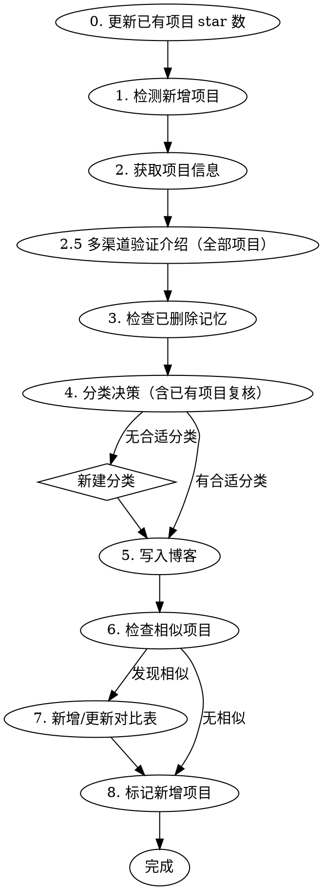

# 同步 GitHub Star 项目到博客

将用户 GitHub 新收藏的项目同步到 `source/_posts/项目收藏.md`，完成分类、写入和同类对比。

## 流程


```dot
digraph sync {
  rankdir=TB;
  update [label="0. 更新已有项目 star 数"];
  detect [label="1. 检测新增项目"];
  info [label="2. 获取项目信息"];
  verify [label="2.5 多渠道验证介绍（全部项目）"];
  check [label="3. 检查已删除记忆"];
  categorize [label="4. 分类决策（含已有项目复核）"];
  newcat [label="新建分类", shape=diamond];
  write [label="5. 写入博客"];
  similar [label="6. 检查相似项目"];
  compare [label="7. 新增/更新对比表"];
  mark [label="8. 标记新增项目"];
  done [label="完成"];

  update -> detect -> info -> verify -> check -> categorize;
  categorize -> newcat [label="无合适分类"];
  categorize -> write [label="有合适分类"];
  newcat -> write;
  write -> similar;
  similar -> compare [label="发现相似"];
  similar -> mark [label="无相似"];
  compare -> mark;
  mark -> done;
}
```

## 0. 更新已有项目 star 数

每次运行 skill 时，先刷新博客中所有已有项目的 star 数：

1. 从博客文件提取所有 `github.com/owner/repo` 链接。
2. 对每个项目调用 `gh api repos/{owner}/{repo} --jq ".stargazers_count"` 获取当前 star 数。**必须逐一实测，禁止沿用博客旧值、凭印象估算或只抽查部分项目**——历史上就出过一次同步后多个 star 数与实际不符的事故。
3. 对每个项目把「API 实测值」和「博客现值」并排比对（建议先落一个 TSV 清单再批量改），只要有差异就更新。四舍五入到一位小数时按真实数字算（如 50543 → 50.5k），不要凭旧值微调。
4. **检查仓库易主/改名**：`gh api` 对 rename/transfer 的仓库会自动跟随 redirect，返回的 `full_name` 可能与博客链接里的 owner 不同（真实案例：`chopratejas/headroom` → `headroomlabs-ai/headroom`、`ogulcancelik/herdr` → `herdrdev/herdr`）。发现这种情况要把博客链接和 star 数一起更正为规范地址，并在汇报中说明。
5. 更新文件顶部或引言中的「Star 数截至」日期为当天。

**注意：** 除 star 数字和已易主的仓库链接外，不改项目名、描述等其他内容（描述修正在第 2.5 步验证后进行）。

## 1. 检测新增项目

用 `gh api` 获取用户最新 star 列表，与博客文件中已有的项目对比：

```bash
gh api users/SpeechlessPanda/starred --jq ".[].full_name"
```

再从博客文件中提取所有 `github.com/` 链接里的 `owner/repo`，两者做差集即为新增项目。

如果用户直接给出了项目 URL，跳过检测，直接用该项目。

## 2. 获取项目信息

对每个新增项目获取 star 数和描述：

```bash
gh api repos/{owner}/{repo} --jq ".stargazers_count, .description, .homepage, (.topics // [])"
```

如果描述不够清晰，用 `gh api repos/{owner}/{repo}/readme` 获取 README 开头内容补充理解。

## 2.5 多渠道验证介绍（新增 + 已有全部项目）

介绍准确性的验证范围是**博客里的所有项目**，不只本轮新增的。只读 README 不够——README 是作者的自我描述，可能过时或夸大。每个项目的介绍至少要交叉验证以下渠道中的两个，重点项目（介绍里有具体数字/排名的）要三个以上：

1. GitHub API 元数据（description、topics、homepage）——注意 description 为空的仓库必须读 README
2. README 正文（`gh api repos/{owner}/{repo}/readme -H "Accept: application/vnd.github.raw"`）
3. 项目官网（homepage 字段指向的站点）
4. WebSearch / WebFetch 第三方来源（报道、评测、awesome 列表收录情况）

**验证要点：**
- **数字类 claim 必须有出处**：如"300+ 助手""259+ 技能""减少 60-95% token"这类具体数字，要在 README/官网找到原文；找不到就改写为不含该数字的表述。注意区分数字的适用范围（真实案例：Headroom 的 60-95% 只针对 JSON 数据，编码代理场景只有 15-20%，博客笼统写成 60-95% 是错的）。
- **区分官方宣称与事实**："基准测试最好""事实标准"这类说法如果只是官方自我宣称，介绍里要点明或直接弱化。
- **功能清单以现状为准**：项目功能会迁移或拆分（真实案例：Pi 的 Slack 机器人已拆到独立仓库 pi-chat，博客还写着包含 Slack 机器人）。以当前 README 的包/功能列表为准。
- **复用已验证的事实**：本轮中 README 已直接确认的表述（如 NapCat README 推荐 SnowLuma）不必再派代理重复搜。
- **项目多时可派并行子代理分组验证**（按分类切分，每组 15-20 个项目），要求每个项目返回 accurate / minor_fix / wrong 三级结论 + 证据 URL + 修正要点。子代理也必须实际 WebSearch/WebFetch，不能只看喂给它的材料。
- 验证发现介绍与事实不符时，修改该条目介绍（这属于"核对修正"，不受"只追加不改已有内容"限制），并在最终汇报中列出所有被改写的条目及原因。

## 3. 检查已删除记忆

读取记忆文件 `blog-deleted-projects`，确认新项目不在已删除列表中。如果在列表中，跳过该项目并告知用户。

## 4. 分类决策

读取当前博客文件，了解所有已有分类。

**分类规则：**
- 扫描已有分类，判断新项目属于哪个（按功能领域匹配，不按技术栈）
- **同时复核已有项目的分类**：第 2.5 步验证后如果发现某项目的真实内容与所在分类不符（真实案例：PaperX 实为"论文 PDF → PPT/海报"的演示生成工具，却凭名字被当成"论文写作辅助"留在学术科研工具里、介绍也写错了），要修正介绍并考虑移到更合适的分类。移动已有条目属于核对修正，需在汇报中说明。
- 如果新项目与已有分类都匹配度不高，则**新建分类**
- 拿不准两个分类时，读分类标题下的说明句，看哪个更贴合项目的**实际用途**而非表面名字

**新建分类时：**
- 分类名用 2-6 个中文字符概括领域（如"排版模板"、"AI 编码代理"）
- 找到逻辑上最相邻的位置插入（如 Typst 模板插在"学术科研工具"后面）
- 在分类标题下写一句分类说明

**除核对修正外不改动已有内容。** 只追加新项目、新增分类或修正经核实有误的条目，不做无依据的风格性改写。

## 5. 写入博客

每个项目的格式：

```markdown
- [项目名](https://github.com/owner/repo) ⭐ {star数} — {一句话简介}。{解决的问题}。{亮点}。
```

**star 数格式：**
- >= 1000：除以 1000 保留一位小数，加 `k`（如 47.0k、130.5k）
- < 1000：直接写数字

**简介要求：**
- 用中文描述
- 先说项目是什么，再说解决什么问题，最后点出亮点
- 控制在 2-3 句话

**插入位置：**
- 归入已有分类时，追加到该分类末尾
- 如果与该分类中某个项目功能类似，将两者相邻排列

## 6. 检查相似项目

写入后，扫描博客中所有分类，判断新项目是否与已有项目功能重叠（同一领域的竞品/替代品）。

**相似判断标准：**
- 解决同一类问题（如都是 AI 编码代理、都是 Typst 模板）
- 用户可能需要二选一
- 功能有重叠但有各自特色

## 7. 新增/更新对比表

博客末尾有「同类项目对比」板块。如果发现相似项目：

1. 检查是否已有该组的对比表
2. 如果没有，新建对比表；如果有，将新项目加入

**对比表格式：**

```markdown
### {领域描述}：{项目A} vs {项目B}

| 维度 | {项目A} | {项目B} |
| --- | --- | --- |
| {维度1} | ... | ... |
| {维度2} | ... | ... |
| 适合人群 | ... | ... |
| 选择建议 | ... | ... |
```

**表格风格：**
- 分隔行用 `| --- |`，单元格之间只保留一个空格
- 源码不强制列对齐，保持简洁紧凑
- 最终渲染或导出 PDF 时表格会自动对齐

**对比维度选择：**
- 交互形式（GUI/CLI/Web）
- 核心能力差异
- 定位和目标用户
- 扩展方式
- 最后加一行「选择建议」，给出明确的选择指引

## 注意事项

- **默认只追加不改已有内容**，但以下核对修正例外，且都要在汇报中逐条说明：star 数实测更正、仓库易主后的链接更正、经多渠道验证确认有误的介绍改写、分类归错的移动
- 用户手动删除过的项目不要恢复，参照记忆文件
- 用户自己名下的仓库（SpeechlessPanda/*）是"自己的项目"而非"收藏"，跳过不入博客
- starred 列表注意分页（`per_page=100&page=N`），拉到空页为止，避免漏掉新 star
- 如果一次有多个新项目，全部处理完后再统一写入，避免多次覆盖
- 每次写入前先 Read 当前文件最新状态，避免覆盖用户的手动编辑
- `gh` 调用失败时先怀疑本机失效代理（见记忆 gh-cli-proxy-quirk）：`HTTPS_PROXY= HTTP_PROXY= gh api ...`

## 8. 标记新增项目

让读者一眼看出哪些项目是最近一次同步新增的。每次运行结束时执行：

1. **清除旧标记：** 在博客文件中搜索所有 bullet 开头的 `- 🆕 [`，把 `🆕 ` 前缀去掉，恢复成普通的 `- [`。这样把上一轮跑出来的标记全部抹掉，得到干净的状态。
2. **添加新标记：** 对本次实际写入博客的新增项目，在每个 bullet 的 `- ` 之后、`[` 之前插入 `🆕 `，最终形如：

   ```markdown
   - 🆕 [项目名](https://github.com/owner/repo) ⭐ {star数} — ...
   ```

**结果：** 博客中始终只有最近一次同步新增的项目带 🆕 标记，老项目不再带标。本轮若没有新增项目，第 1 步执行后整篇就没有任何 🆕 了，也是正常状态。

**注意：** 只处理 bullet 开头的 `🆕 `，不要误伤项目描述里出现的 emoji。匹配时锁定 `- 🆕 [` 这个完整模式。
